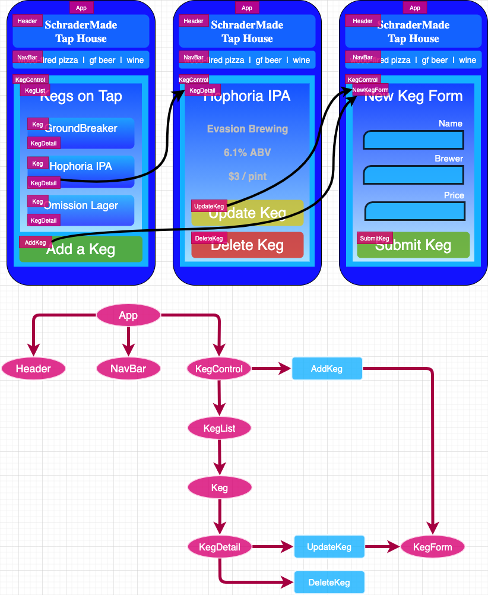

<div align="center">
  <h1>SchraderMade Tap House</h1>
  <br>
  <h2>A React application by:</h2>
  <h3>Nathan Schrader</h3>
  <h5>Created Feb 12th, 2021.</h5>
</div>


<p align="center">
    <!-- Project Image -->
    <br>
    <a>
        <!--  -->
    </a>
    <p align="center">
      ___________________________
    </p>
    <!-- Project GitHub Link -->
    <p align="center">
        <a href="https://github.com/schradermade/tapRoom">
            <strong>Link to this project's GitHub Repo</strong>
        </a> 
    </p>
</p>
<br>

# 🗄 Table of Contents
  - <a href="#📖-project-description">Project Description</a>
  - <a href="#🔎-api-information">Component Diagram</a>
  - <a href="#🛠-technologies-used">Technologies Used</a>
  - <a href="#🧩-getting-started">Getting Started</a>
  - <a href="#📂-setup-and-use">Setup and Use</a>
  - <a href="#🦠-known-bugs">Known Bugs</a>
  - <a href="#☎️-contact-and-support">Contact</a>
  - <a href="#🛡-license">License</a>
<br><br>

# 📖 Project Description
This project was created in Week 15 of the Epicodus Coding School, using React. The objective was to build a Single Page Application that allows a restaurant owner to manage their keg inventory.
<br><br>

# 🔎 Component Diagram

<br><br>

# 🛠 Technologies Used
- [React.js](https://reactjs.org/)
- [JavaScript](https://www.javascript.com/)
- [Visual Studio Code](https://code.visualstudio.com/)
- [Git](https://git-scm.com/)
<br><br>

# 🧩 Getting Started

### Code Editor

To view or edit the code, you will need a code editor or text editor. Popular open-source choices for a code editor are Atom and VisualStudio Code.

1. Code Editor Download:
   - Option 1: [Atom](https://nodejs.org/en/)
   - Option 2: [VisualStudio Code](https://www.npmjs.com/)
2. Click the download most applicable to your OS and system.
3. Wait for download to complete, then install -- Windows will run the setup exe and macOS will drag and drop into applications.
4. Optionally, create a [GitHub Account](https://github.com)
<br><br>

# 📂 Setup and Use

### Download Project from Github

1. Open your terminal and navigate to a directory that you wish to download this project to.
2. Type the following line of code into your terminal, then press 'Enter'. Project will automatically begin downloading to your current directory.

    <code>git clone https://github.com/schradermade/tapRoom.git</code>

### Open Project in Code Editor

3. Once the project has finished downloading from Github, open the project in your code editor.

### Install Dependencies

4. With the project now opened in your code editor, use the terminal to navigate to the “__tap-room__" folder of the project and run this command:
    - `npm install`

### Run Application Locally
5. After running the `npm` command above, the project is ready to run locally. To run the application in your internet browser, type this command in your code editor's Terminal:
    - `npm start`

The application should automatically start up in your browser, typically at `localhost:3000`
<br><br>

# 🦠 Known Bugs
At this time, there are no known bugs. If you see spot a bug feel free to make a pull request.
<br><br>

# ☎️ Contact and Support
If you have any feedback or concerns, please contact <natecschrader@gmail.com>.
<br><br>

# 🛡 License
This repository is licensed under the MIT license.

Copyright (c) 2020 by _Nathan Schrader_

```

Permission is hereby granted, free of charge, to any person obtaining a copy
of this software and associated documentation files (the "Software"), to deal
in the Software without restriction, including without limitation the rights
to use, copy, modify, merge, publish, distribute, sublicense, and/or sell
copies of the Software, and to permit persons to whom the Software is
furnished to do so, subject to the following conditions:

The above copyright notice and this permission notice shall be included in all
copies or substantial portions of the Software.

THE SOFTWARE IS PROVIDED "AS IS", WITHOUT WARRANTY OF ANY KIND, EXPRESS OR
IMPLIED, INCLUDING BUT NOT LIMITED TO THE WARRANTIES OF MERCHANTABILITY,
FITNESS FOR A PARTICULAR PURPOSE AND NONINFRINGEMENT. IN NO EVENT SHALL THE
AUTHORS OR COPYRIGHT HOLDERS BE LIABLE FOR ANY CLAIM, DAMAGES OR OTHER
LIABILITY, WHETHER IN AN ACTION OF CONTRACT, TORT OR OTHERWISE, ARISING FROM,
OUT OF OR IN CONNECTION WITH THE SOFTWARE OR THE USE OR OTHER DEALINGS IN THE
SOFTWARE.

```